# Звіт до роботи

## Тема: Автоматизація процесу тестування

### Мета роботи: Виконати всі завдання та приклади з завдання, лекцій і лабораторних

---

### Виконання роботи

* Результати виконання завдання:
    1. Виконано всі завдання з розділу "Створення першого Workflow з шаблону";
    2. Виконано всі завдання з розділу "Редагування Workflow";
    3. Виконано всі завдання з розділу "Запуск Workflow вручну та по Cron";
    4. Виконано всі завдання з розділу "Створення декількох Workflow або завдань";
    5. Виконано всі завдання з розділу "Перевірка умов для запуску завдань або кроків";
    6. Виконано всі завдання з розділу "Баджі та статуси".

* Скріншоти виконаних завдань:
    ```
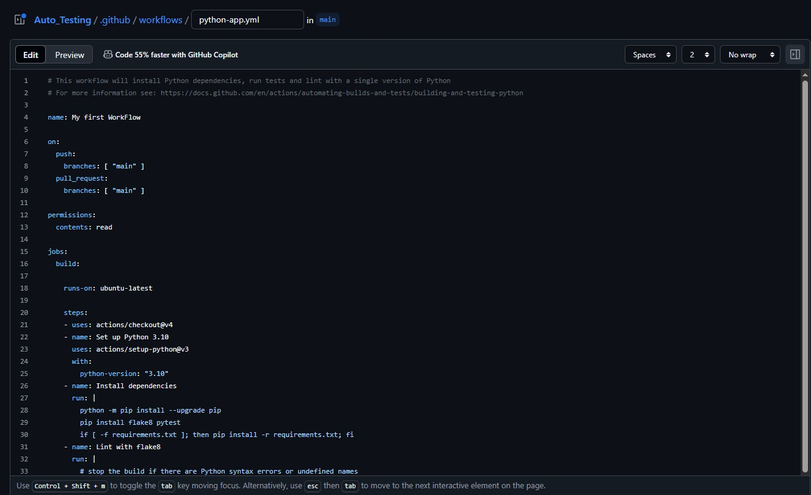
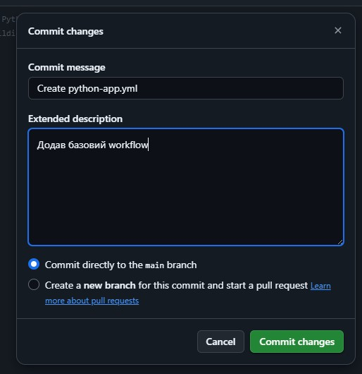
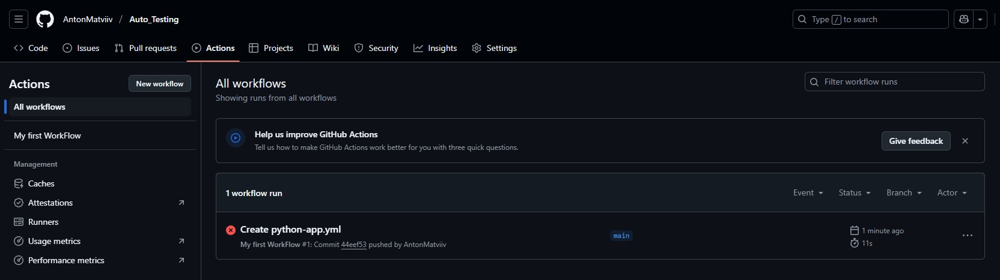
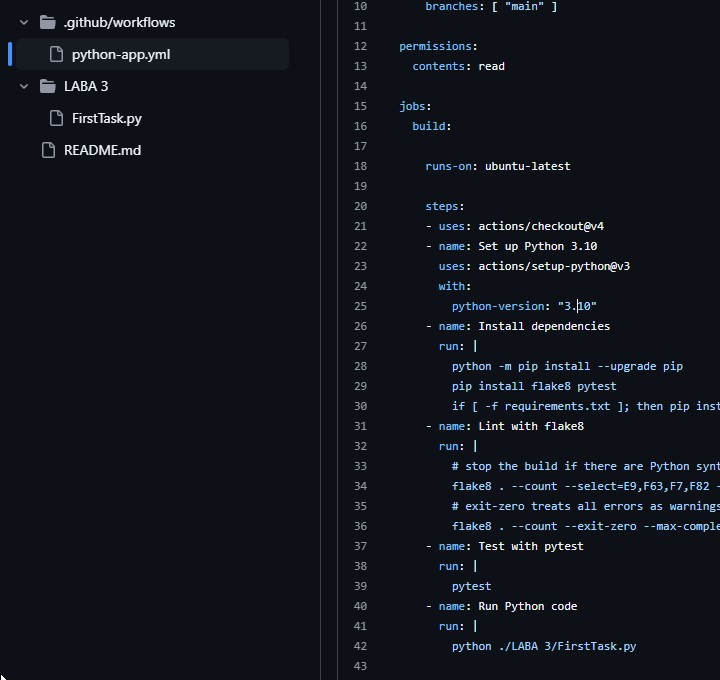
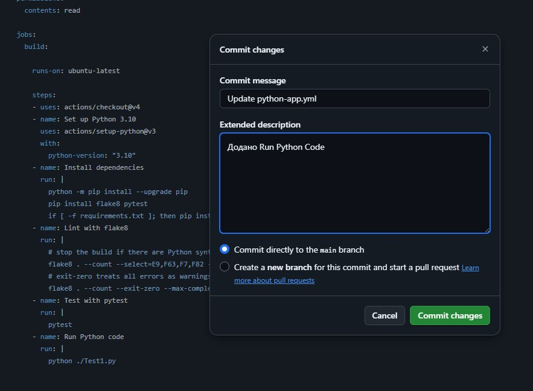
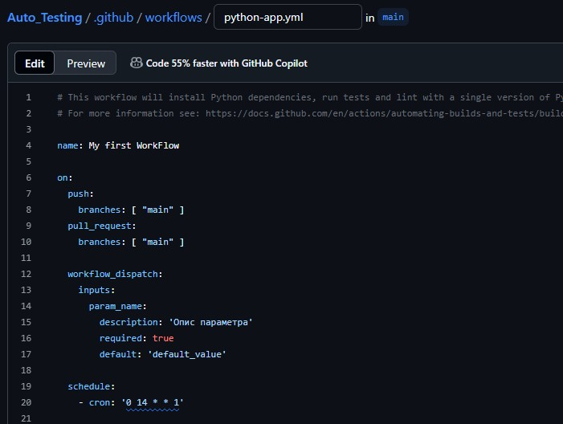
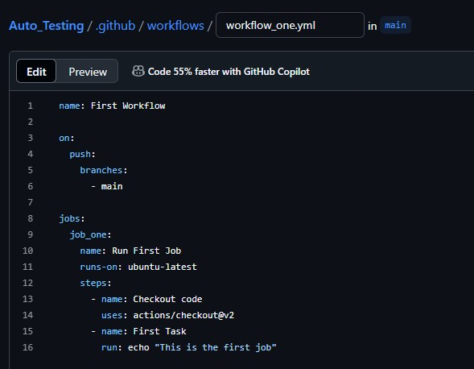
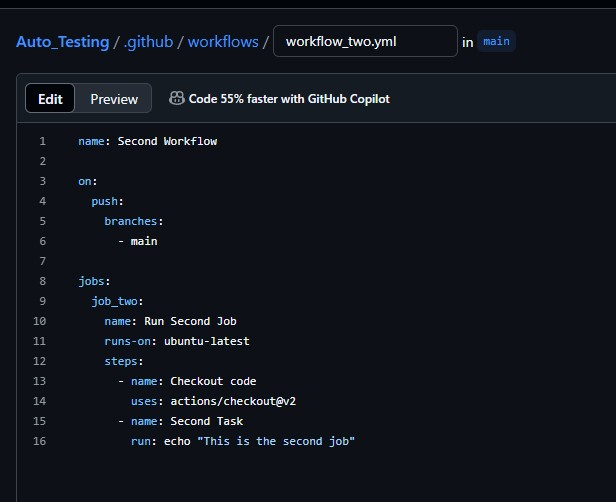
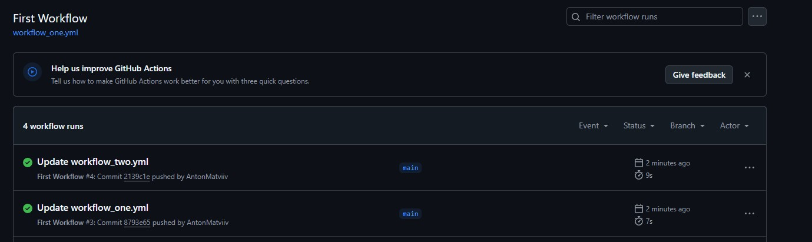
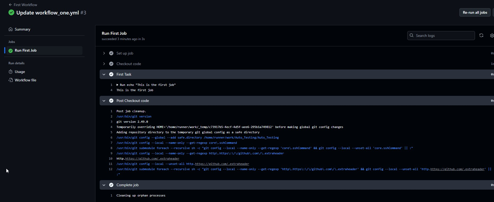
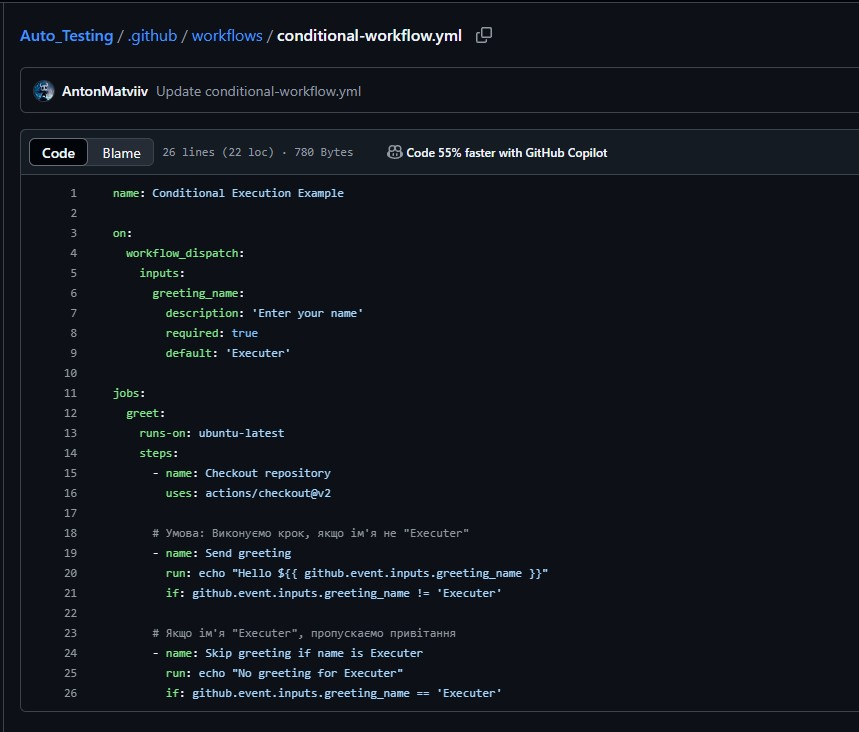
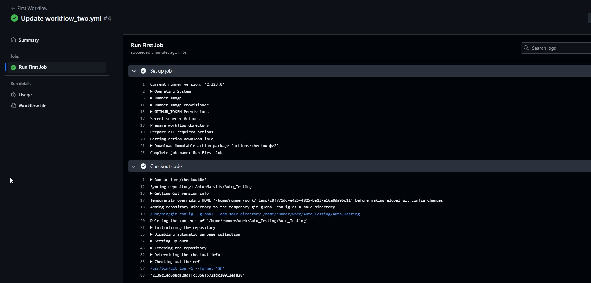

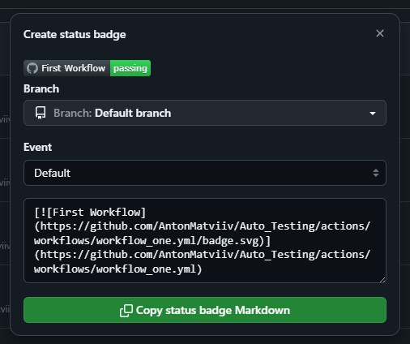
    ```

### Висновок:
- :question: Що зроблено в роботі - Виконано всі завдання та приклади з завдання, лекцій і лабораторних (окрім додаткового завдання з Coverage).
- :question: Чи досягнуто мети роботи - Так.
- :question: Які нові знання отримано - Те, як проводити автоматизацію процесу тестування.
- :question: Чи вдалося відповісти на всі питання, задані в ході роботи - Частково.
- :question: Чи вдалося виконати всі завдання - Частково.
- :question: Чи виникли складності у виконанні завдання - Деякі, але вдалось розібратись.
- :question: Чи подобається такий формат здачі роботи (Feedback) - Так.
- :question: Побажання для покращення (Suggestions) - Ні.

---
